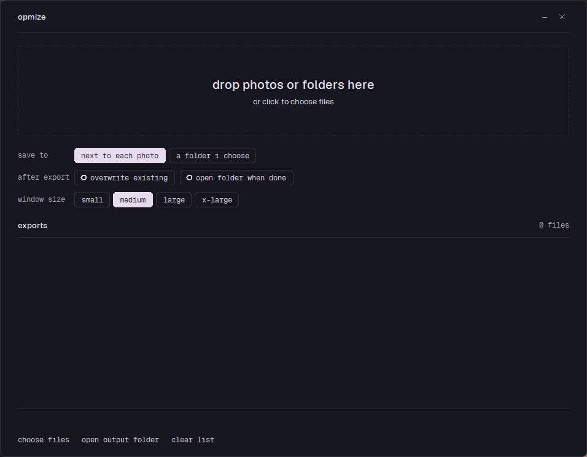

# Opmize

Drop photos in, get Instagram-ready JPEGs out. One drop, done.

Nothing is ever cropped, nothing is enlarged, and the originals are never touched.

<p>
  <a href="https://github.com/magholmes/Opmize/releases/latest/download/Opmize.exe">
    </a>
  &nbsp;
  <a href="https://github.com/magholmes/Opmize/releases/latest/download/Opmize.mac.arm64.zip">
    </a>
</p>

Nothing to install. On Windows it is one file — drop photos straight onto the icon, or open it and
drop them in the window. The macOS download is `Opmize.app` for Apple silicon, built on a macOS
runner by the workflow in `.github/workflows`.

Neither build is signed, so the first run shows a warning: on Windows **More info → Run anyway**,
on macOS right-click the app and choose **Open**.



## What every photo gets

Baked in, tuned for Instagram — there are no quality knobs to get wrong.

- **2160 px wide**, portrait or landscape, with the photo's own aspect ratio kept. A 4:5 frame becomes 2160×2700, 3:4 becomes 2160×2880, 3:2 landscape becomes 2160×1440, 1:1 becomes 2160×2160. Instagram has kept uploaded masters above 1080 px since May 2026 and serves them in full on the web; 2160 is exactly twice the 1080 rung phones get.
- **Colour handled properly.** Any embedded profile — Adobe RGB, ProPhoto, Display P3, scanner profiles — is converted to sRGB, and the standard sRGB IEC61966-2.1 profile is embedded. Untagged files are treated as sRGB.
- **Full anti-aliased Lanczos** resampling in 32-bit float from 8- or 16-bit sources, then a light luminance-only screen sharpening (about Lightroom's "Screen, Standard"), then dithered down to 8-bit.
- **JPEG quality 93, 4:4:4 chroma**, baseline, no EXIF and no GPS. Files usually land between 2 and 5 MB.

Photos taller than 3:4 or wider than 1.91:1 are still exported whole; Instagram shows those trimmed to its own frame unless you tap the fit button in its composer. The row note tells you when that applies.

## Big files

Any size works. A 300-megapixel scan is read in bands and box-reduced on the way in, so it never needs gigabytes of RAM. Uncompressed TIFFs are memory-mapped straight from disk, and huge JPEGs are downscaled inside the decoder first.

## Running from source

```bash
git clone https://github.com/magholmes/Opmize.git
cd Opmize
python -m pip install -r requirements.txt
```

Then double-click `opmize.pyw`, or run `Launch Opmize.bat`.

`opencv-python` is optional and only used to read 16-bit PNGs at full depth; after the downscale and dither the difference is not visible.

## Using it

1. Drag photos or whole folders onto the dashed field, or click it to pick files. You can also drop files onto the built `.exe` in Explorer.
2. Each photo is processed immediately and appears in the list.
3. Exports land in an `instagram_export` subfolder next to each photo, or in a folder you choose.
4. Double-click a row to open that export.

The window has no title bar: drag it by the top row, and use the small `–` and `×` at the top right. Alt+F4 and the taskbar work as usual. "Window size" sets the whole window's scale and is remembered.

Supported input: TIFF (8/16-bit, including Photoshop TIFFs), JPEG, PNG, WebP, BMP, PSD (flattened composite), HEIC/HEIF.

## Uploading

Move the JPEGs to your phone byte-exact — AirDrop, Quick Share, LocalSend, USB, or a cloud original — or upload from instagram.com on a computer. In the composer choose the Original crop, no filter, no in-app edits, keep "Upload at highest quality" on and data saver off. Schedulers and the Graph API cap at 1440 px and 4:5, so avoid them for these.

## Batch mode

No window, for scripts:

```bash
python opmize.pyw --cli OUTPUT_FOLDER photo1.tif photo2.jpg
```

It writes the JPEGs plus a `cli_report.json` into `OUTPUT_FOLDER`. The built `.exe` takes the same arguments.

## Building

**Windows** — `.\build_windows.ps1` produces a single `dist\Opmize.exe` that needs nothing installed.

**macOS** — `bash build_mac.sh` produces `Opmize.app`. See [MAC_BUILD.md](MAC_BUILD.md) for the details; the same folder is the whole build kit.

Both run `smoke_test.py` first, which checks the pipeline geometry, colour handling and big-file streaming, then opens a hidden window and simulates a drop.

If Windows shows "Windows protected your PC" the first time someone opens the `.exe`, that is SmartScreen reacting to an unsigned program: **More info → Run anyway**.

## Look and feel

Are.na's "Dusk" theme — its purple-tinted grey ladder, taken from are.na's own theme table — with the layout language of the magnus archive site: hairlines, Geist and Geist Mono, lowercase mono labels and pill controls, in a frameless window with rounded corners. Rounding needs Windows 11; on Windows 10 the corners stay square.

The same design language, with switchable palettes, is in [MagCopy](https://github.com/magholmes/MagCopy).

## Where things are kept

Settings sit next to the script, or in `%APPDATA%\Opmize\` for the built `.exe`. If anything goes wrong, look for `errors.log` and `crash.log` in the same place.

## Licences

Opmize is MIT (see `LICENSE`). [Geist and Geist Mono](https://vercel.com/font) are bundled under the SIL Open Font Licence — see `fonts/LICENSE-Geist-OFL.txt`.
